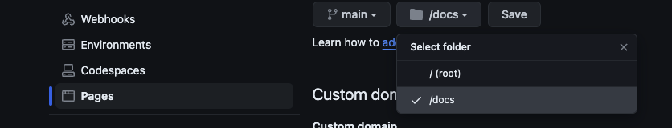
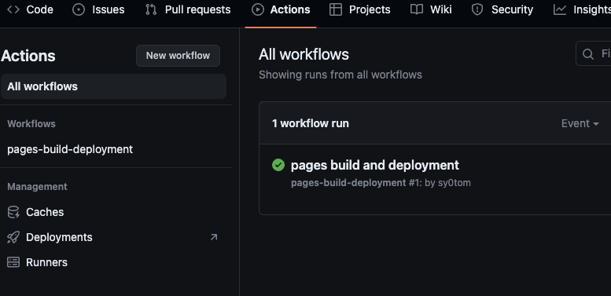
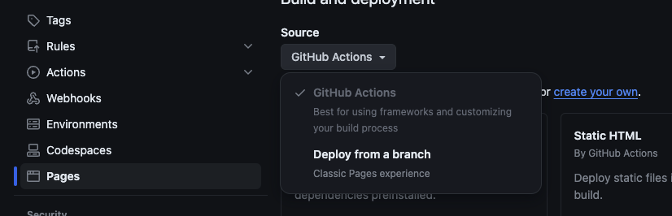
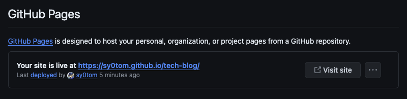
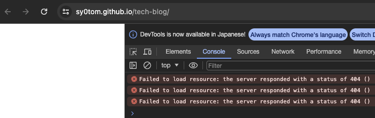
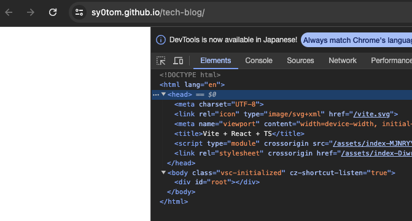

# React + Vite で GitHub Pages にブログを公開する

React + Vite で GitHub Pages にブログを公開する方法を紹介します。

## 目次

1. [セットアップ](#セットアップ)
1. [GitHub Pages への公開](#github-pagesへの公開)
    1. [ブランチのディレクトリ指定での公開方法](#ブランチのディレクトリ指定での公開方法)
    1. [GitHub Actionsでの公開方法](#github-actionsでの公開方法)

## セットアップ

1. NodeJSのインストール

    ```sh
    > brew install nodenv
    > exec $SHELL -l
    > nodenv install --list
    > nodenv install 20.5.1
    > nodenv global 20.5.1
    ```

1. パッケージマネージャのインストール

    ```sh
    > brew install pnpm
    > pnpm setup
    ```

1. プロジェクトの作成

    ```sh
    > pnpm create vite
      ✔️ Project name: <project name>
      ✔️ Select a framework: React
      ✔️ Select a variant: TypeScript

    > cd <project name>
    > pnpm i
    ```

1. 起動時のポートを変更する場合は`vite.config.ts`を以下のように修正する

    ```diff
      import { defineConfig } from 'vite';
      import react from '@vitejs/plugin-react';

      // <https://vitejs.dev/config/>
      export default defineConfig({
    +   server: {
    +   port: <任意のポート番号>,
    + },
      plugins: [react()],
      });
    ```

1. プロジェクトの実行

    ```sh
    > pnpm dev
      VITE v5.2.0  ready in 85 ms

    ➜  Local:   http://localhost:8080/
    ➜  Network: use --host to expose
    ➜  press h + enter to show help
    ```

## GitHub Pagesへの公開

GitHub Pagesへの公開はブランチのディレクトリ指定とカスタマイズしたGitHub Actionsによるデプロイの2通りある。  

### ブランチのディレクトリ指定での公開方法

1. 公開用ディレクトリの作成
GitHub Pagesに公開するには`<root dir>`または`docs`にindex.htmlが存在する必要がある。  
今回はビルド時に`dist`ディレクトリをコピーして`docs`ディレクトリを作成する。
    - `package.json`

        ```diff
          "scripts": {
            "dev": "vite",
            "build": "tsc && vite build",
        +   "gen_pages": "rm -rf docs && cp -r dist docs",
            "lint": "eslint . --ext ts,tsx --report-unused-disable-directives --max-warnings 0",
            "preview": "vite preview"
          },
        ```

1. ビルド

    ```sh
    > pnpm build
    > pnpm gen_pages
    ```

1. `Settings > Pages`からページを指定して公開する

    

    ページを公開するとGitHub Actionsが作成される

    

### GitHub Actionsでの公開方法

1. `.github/workflows/deploy-pages.yml`を作成する

    ```yml
    name: deployPages

    on:
      push:
        branches: ["main"]
      workflow_dispatch:

    permissions:
      contents: read
      pages: write
      id-token: write

    concurrency:
      group: "pages"
      cancel-in-progress: true

    jobs:
      deploy:
        environment:
          name: github-pages
          url: ${{ steps.deployment.outputs.page_url }}
        runs-on: [ubuntu-latest]
        steps:
          - name: Checkout
            uses: actions/checkout@v4
          - name: Setup Node.js
            uses: actions/setup-node@v4
            with:
              node-version: "20"
          - name: Setup pnpm
            run: npm i -g pnpm
          - name: Install dependencies
            run: pnpm i --frozen-lockfile
          - name: Build
            run: pnpm run build
          - name: Setup Pages
            uses: actions/configure-pages@v4
          - name: Upload artifact
            uses: actions/upload-pages-artifact@v3
            with:
              path: './dist'
          - name: Deploy to GitHub Pages
            id: deployment
            uses: actions/deploy-pages@v4
    ```

1. `Settings > Pages`からページを指定して公開する

    

### 公開されたページを確認する

公開されたページを確認すると、リソースが`404`エラーとなるため、`base`を相対パスに変更する。







- `vite.config.ts`

    ```diff
      import { defineConfig } from "vite";
      import react from "@vitejs/plugin-react";

      // <https://vitejs.dev/config/>
      export default defineConfig({
        server: {
            port: 8080,    // ポートを任意の番号に変更
        },
    +   base: "/.",      // ベースパスを相対パスに変更
        plugins: [react()],
      });
    ```

1. 再度ビルドしてプッシュするとリソースが正常に読み込まれる

    
